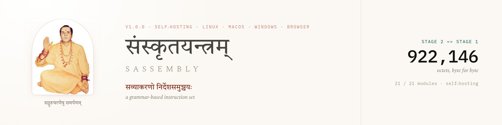

<p align="center">
  
</p>

# Sassembly

**A compiler that compiles itself, written in a language with no English in it,
targeting bare-metal RISC-V.**

<https://github.com/paramtatv/sassembly> · docs and playground:
<https://paramtatv.github.io/sassembly/> · study group:
[Discord](https://discord.gg/TFmdNsUV7)

Sassembly is an instruction set architecture and a systems language whose
keywords are Sanskrit words and whose operand roles are marked by **kāraka
sigils** rather than by position or punctuation. Its compiler is written in
Sassembly. That compiler, compiled by itself, produces a byte-identical copy of
itself.

This release is a **research artifact**. It is a compiler milestone, not an
application toolchain — see [What this cannot do](#what-this-cannot-do), which
is deliberately placed before the tutorial.

---

## The claim, and how to check it

The interesting property of a self-hosting compiler is a fixpoint: if you
compile the compiler with itself, you should get the compiler back. Not an
equivalent binary — *the same bytes*.

```
Stage 1   the compiler's 21 sources, compiled by the interpreted compiler
Stage 2   Stage 1 running natively on RISC-V, compiling those same 21 sources
```

**Measured 2026-09-24, `tools/fixpoint.sh`:**

| quantity | value |
|---|---|
| Stage 2 == Stage 1 | **byte-identical** |
| image size | **1,393,602 octets** |
| sources | **21** `.t1` files, 39,775 lines |

Reproduce it:

```sh
cargo build --release -p sadhana -p yantra   # builds t1_image and yantra-run
tools/fixpoint.sh
```

This needs five things present, and they are the whole of what "the compiler"
means here: the 21 `.t1` sources, the `spec/` tables (which the host fills), the
`t1_image` driver, the `yantra` RISC-V emulator, and
`tools/pack-corpus.py`. Without them the headline number above is a claim you
would have to take on trust rather than check.

The script packs the source blob from the working tree **immediately before the
build**, with no reuse flag. That is not incidental: an earlier run of this
measurement was invalidated by a blob packed four hours before the edit it was
supposed to test, and reported a divergence that did not exist. The tell was
that a *different* Stage 1 produced a byte-identical Stage 2. The script now
makes staleness impossible rather than unlikely.

### A separate result: the whole corpus as one running image

Distinct from the fixpoint, and worth stating separately because the numbers get
confused:

**Measured 2026-09-18** — 21 sources, 21 objects linked into one image of
**1,373,231 octets**, which *runs*: `halt Finisher { value: 21845, status:
Some(0) }`, 1,763 s.

That is a different artifact from the 1,393,602-octet fixpoint image, built on a
different date. Neither number is a typo for the other.

---

## What this cannot do

Stated first, and in full, because a self-hosting compiler invites the
assumption that a general-purpose toolchain comes with it. It does not.

| | |
|---|---|
| **name or open a file** | no |
| **write a file** | no |
| **command-line arguments** | no |
| **network, sockets, servers** | no — and *undesigned*, not merely unbuilt |
| **threads, concurrency** | no |
| **clock** | no |
| **standard library** | `lib.t1` is fifteen lines of comments and declares no module, so nothing can import it |

Networking is the one that is not a matter of effort. **Nothing in the language
can express "not yet."** A file read has two outcomes, a byte or the end; a
socket read has three, and the third has no representation — no sentinel, no
blocking call, no way to yield. `ecall` appears **zero** times as something a
program can emit. Before a socket device can exist, someone has to decide
whether a Sassembly program may be *suspended at all* — and every measurement
this project owns is shaped as "run it and read the status", which assumes a run
that ends. [WHY-NO-NETWORKING.md](WHY-NO-NETWORKING.md) (ADR-0040)
records the question and the two candidate answers, and adopts neither.

---

## What a program can do today

All of the following are measured and have guard tests, listed so the claims can
be checked rather than taken:

| capability | measured | guard |
|---|---|---|
| compute, branch, loop, records, arenas | `status: Some(55)` = Σ1..10 | — |
| compile a fresh program | **13.4 s**, 65,832-octet ELF | — |
| **read the input it was given** | `status: Some(2289)`, the exact octet sum of a 25-byte file | `crates/yantra/tests/t1_user_input_interface.rs` |
| **allocate dynamically** | a run grown to 5,000 elements and summed | `crates/yantra/tests/t1_user_allocation.rs` |
| **print to the console** | `HI!\n`, asserted from **both** engines | `crates/yantra/tests/t1_user_console.rs` |
| return a result | the finisher status — **sixteen bits** |  — |

Two footnotes that will otherwise cost you an afternoon:

**The status is sixteen bits.** A correct answer above 65535 looks like garbage.
Compare modulo 65536 before concluding anything is broken: a fixture summing
0..4999 = 12,497,500 reports 45,660, and that is right.

**"Reading input" is not a file API.** The host writes the file's octets *into
RAM before the program starts*, locating the slots by scanning memory for a magic
word. There is no port and no syscall. That is why it costs nothing, and also why
it does not generalise: naming a file requires the program to ask the host
something *while running*.

---

## The heap already exists

The image's `.bss` declares ~537 MB, which looks like a defect and is not. Of
that, the 21 objects contribute **211,248 octets — 0.04%**. The remaining
536,870,912 is 2²⁹ exactly: `यन्त्ररचनाष्टकाः`, a **512 MiB record region**
declared at `yantrotsarjana.t1:1834` and sized in 2026-09 from a measurement (the
first whole-corpus native compile reached 353,242,600 octets of high water; 512
MiB is 1.5× that).

**The `.bss` *is* the heap.** Run growth bumps a cursor into that region with the
existing load/store primitives — "no new kind" (`ir.t1:604`). A bump allocator
needs no new linker symbols.

---

## Verification

```sh
cargo test -p sadhana-t1 -p sanskrit-text -p yantra --no-fail-fast
```

**Measured 2026-09-25: 129 targets, 1,151 passed, 0 failed, 56 ignored, exit 0.**

That figure is the three crates this release is built from. It does not include
the wider project's hourly gate, which checks an operating system this repository
is not.

`GATE_STRICT=1` is armed on that wider runner: a check that *cannot run* fails
rather than passing quietly. It is distinguished from a check that has *no
subject* — those two conditions shared an exit code until 2026-09-24, and while
they did, arming strictness would have failed every commit that touched no `.t1`
file.

---

## Reading the source

Two conventions are worth knowing before opening a file, because both are easy
to misread:

* `ॱॱ` marks a **type** position; `॰` opens a **margin** (a comment). They are
  distinct glyphs and a grep that conflates them finds the wrong lines.
* Devanagari **sandhi** fuses compounds at boundaries, so a routine's emitted
  label is often *not* the spelling in its source. `खण्डवृद्धिः` appears in no
  source file at all — it is synthesised per module by `ir.t1:645`.

---

## Two things a reader will notice

**Some comments point at files that are not here.** Twenty-three of them
reference `.loop/STATE.md`, `.loop/ASSUMPTIONS.md` or `.loop/METRICS.tsv` —
the private project's decision log, where a measurement or a ruling was
recorded. They are provenance markers, not broken code, and they are left
exactly as written for a specific reason: one of them is inside
`crates/sadhana-t1/src/encode.t1`, and **editing any `.t1` file changes the
1,393,602-octet image**. The fixpoint number above is the claim of this
repository, so the sources are published byte-for-byte as measured rather than
tidied.

The same goes for margins citing "doc 03 §6" or "doc 18 §0" — internal design
documents. Nothing in the code depends on reading them.

**The crate names are Sanskrit too.** `sadhana` is the toolchain, `yantra` the
RISC-V emulator, `sanskrit-text` the text kernel (segmentation, normalisation,
identifiers), and `sadhana-t1` holds the 21 Sassembly sources that are the
compiler.

## Status and stability

This is version **v0.2.0**. Nothing here is stable: not the surface syntax, not
the object format, not the tool names. The fixpoint is the result; the interfaces
around it are scaffolding for reaching it.

The compiler is two stages —
`src --मण्डलसङ्कलनम्--> asm --पाठवस्तुरचना--> object` — and feeding source to
stage 2 is an error, not a shortcut.

## The study group

There is a Discord for reading this compiler together —
**<https://discord.gg/TFmdNsUV7>**.

It is for people who want to work through the sources rather than watch from
outside: how a `यदि` arm becomes a block, why `अष्टकॱमुद्रणम्` is a store and
not a call, what a kāraka sigil buys over positional operands, and how the
fixpoint is actually measured. The 21 `.t1` files are the whole compiler and
they are readable — but they are readable in Sanskrit, and reading them in
company is faster than reading them alone.

Bring a question about a specific line. That works better here than a general
one.

## Licence

**MIT.** See [LICENSE](LICENSE).

The licence file sits in this directory, not at the enclosing repository's root,
and that is deliberate: the wider project this compiler was extracted from is
private and not for distribution. MIT covers **what is published here** — the
Sassembly sources, the driver, the emulator and the tools needed to reproduce the
fixpoint — and nothing else.
